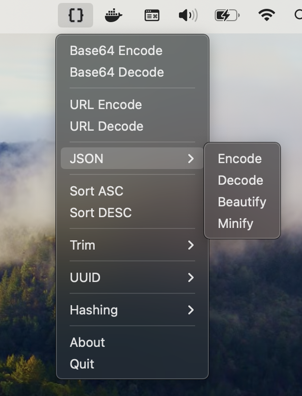

# DMTool

Tool for developers. Perform operations on your clipboard data with ease.

## Features

- Base64 Encode/Decode
- URL Encode/Decode
- JSON Beautify and Minify
- Sorting and trimming
- Generate, validate and detect UUID. Convert between UUID V1 and V6
- Hashing (MD5, SHA, BLAKE)

## Usage

1. Copy the data you want to perform an operation on
2. Select the operation from the dropdown
3. Paste the result

## Download

Download the latest version from the [releases page](https://github.com/dmasior/dmtool/releases).

## License

MIT.
