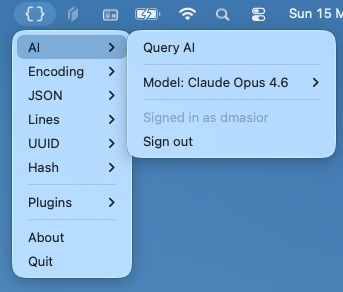

# DMTool

A menu bar utility that transforms your clipboard - encode, format, hash, and more.

## Features

- **AI** — Query GitHub Copilot models with your clipboard as context
- **Encoding** — Base64, URL, HTML entities (encode/decode)
- **JSON** — Validate, beautify, minify, escape/unescape
- **Lines** — Sort, trim
- **UUID** — Detect version, generate V1/V4/V6/V7
- **Hash** — MD5, SHA1
- **Plugins** — Extend with custom JS plugins (see [PLUGINS.md](PLUGINS.md))

## Usage

1. Copy text to your clipboard
2. Click the DMTool icon in the menu bar
3. Select an operation
4. The result is automatically copied — just paste

## Plugins

DMTool supports user-defined plugins loaded from `~/.dmtool/plugins/`. Plugins are ES modules that add custom actions to the tray menu. Environment variables can be provided via `~/.dmtool/.env`.

See [PLUGINS.md](PLUGINS.md) for the full plugin API and examples.

## Download

Download the latest version from the [releases page](https://github.com/dmasior/dmtool/releases).

## License

MIT.
