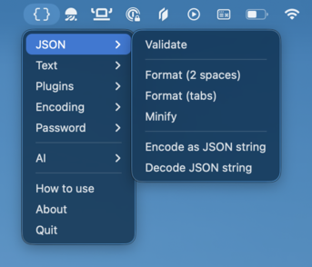

# DMTool

A menu bar utility for clipboard transformations, password generation, and AI queries.

## Features

- **JSON** — Validate, format, minify, encode/decode JSON strings
- **Text** — Sort lines and trim whitespace around clipboard text
- **Plugins** — Extend with custom JS plugins (see [PLUGINS.md](PLUGINS.md))
- **Encoding** — Base64, URL, HTML entities (encode/decode)
- **Password** — Generate 16-character passwords or choose a custom length from 1 to 128, with or without symbols
- **AI** — Query GitHub Copilot or OpenAI (ChatGPT/Codex) models with your clipboard as context
- **How to use** — Open instructions directly from the tray menu

## Usage

1. Copy text to your clipboard
2. Click the DMTool icon in the menu bar
3. Select an operation
4. The result is automatically copied — just paste

JSON validation shows a status message instead of replacing clipboard text. AI opens a prompt window; copy the response when it is ready.

### Passwords

Choose letters and digits, with or without symbols. Generate 16 characters or set a custom length (1–128). Passwords use cryptographic randomness and copy directly to the clipboard.

Choose **How to use** above **About** for in-app instructions.

### AI

- Choose **AI → Provider**: **GitHub Copilot** or **OpenAI (ChatGPT)**. Sign in, select a model, and choose **Ask AI…**; clipboard text provides context. Use **Copy response** to copy the answer or **Refresh models** to update the catalog.
- OpenAI uses browser device-code login and requires Codex access; account model availability and usage limits apply.

## Plugins

DMTool supports user-defined plugins loaded from `~/.dmtool/plugins/`. Plugins are ES modules that add custom actions to the tray menu. Environment variables can be provided via `~/.dmtool/.env`.

See [PLUGINS.md](PLUGINS.md) for the full plugin API and examples.

## Download

Download the latest version from the [releases page](https://github.com/dmasior/dmtool/releases).

## License

MIT.
