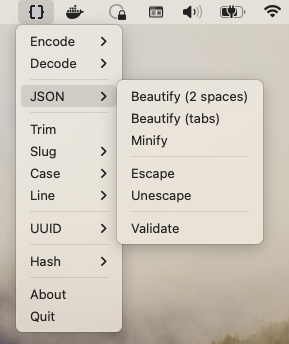

# DMTool

Tool for developers. Perform operations on your clipboard data with ease.

## Features

- Encode and decode: Base64, Hex, URL, HTML
- JSON utility functions
  - Beautify and minify
  - Escape and unescape
  - Validate
- Trim
- Convert case
  - Uppercase, lowercase
  - Capitalize words, sentences
  - CamelCase, snake_case, kebab-case
- Line
  - Count, sort, trim, reverse
  - Remove empty
  - Remove duplicates
- UUID
  - Generate V1, V4, V6, V7
  - Validate
  - Convert between V1 and V6
- Hash
  - MD5, SHA1,
  - SHA256, SHA384, SHA512,
  - SHA3-256, SHA3-384, SHA3-512,
  - BLAKE2b
## Usage

1. Copy the data you want to perform an operation on
2. Select the operation from the dropdown
3. Paste the result

## Download

Download the latest version from the [releases page](https://github.com/dmasior/dmtool/releases).

## License

MIT.
